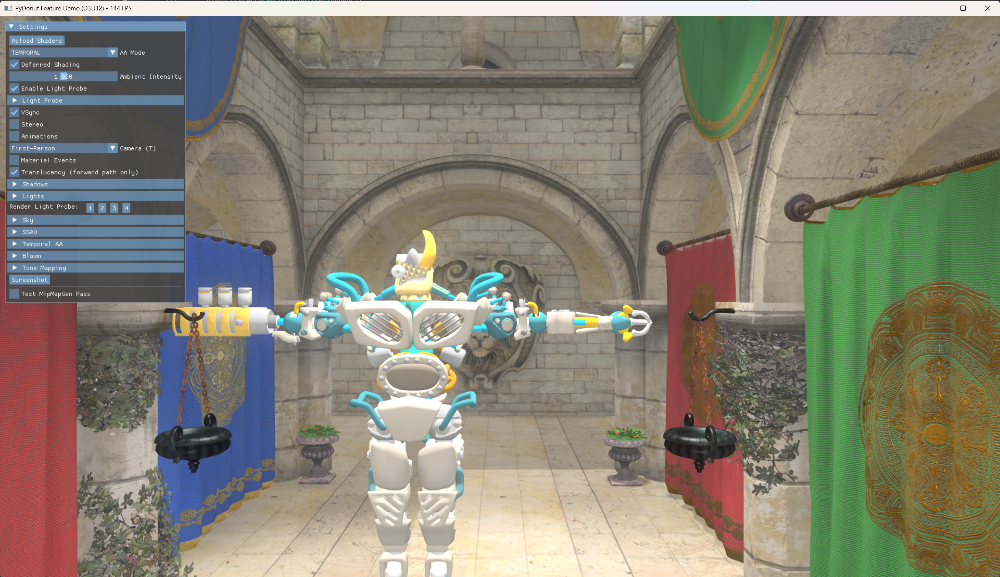
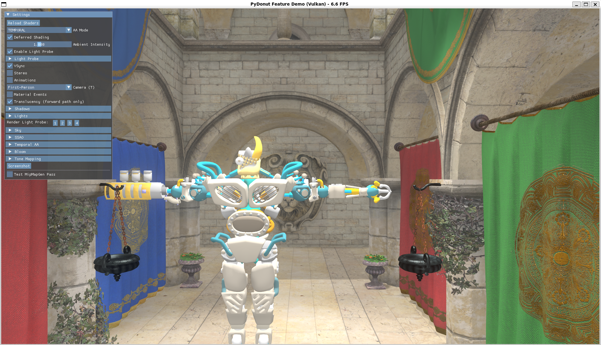
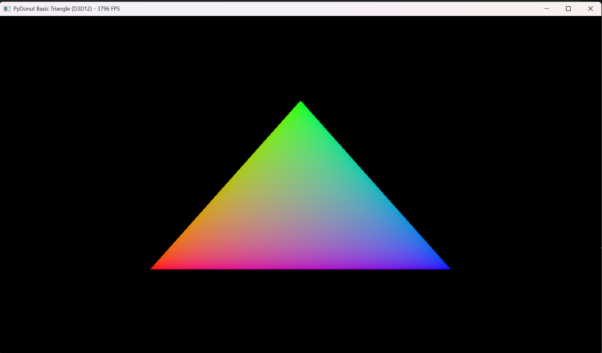
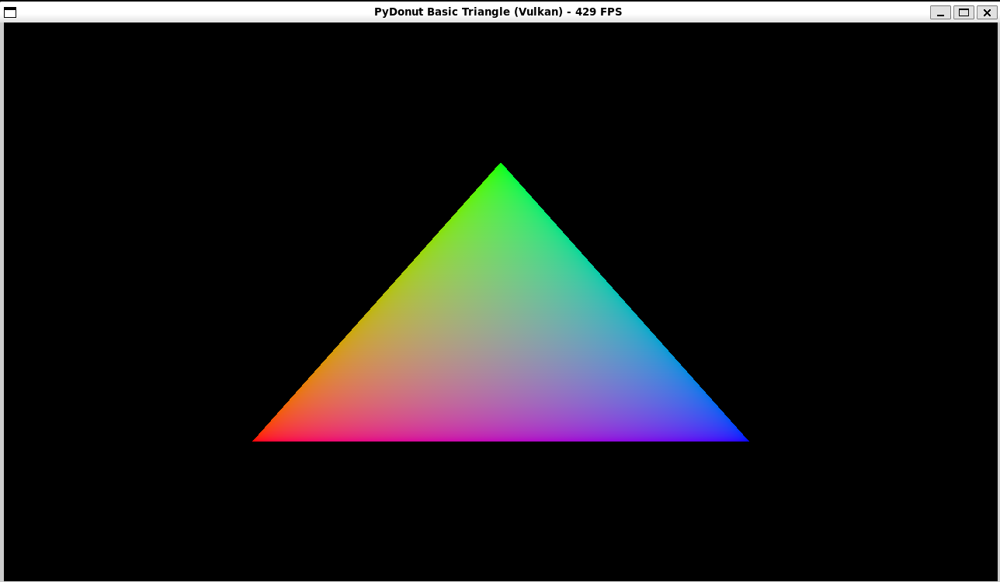

# PyDonut — Python bindings for NVIDIA Donut & NVRHI (DirectX 12 and Vulkan)

**Write real-time 3D graphics, hardware ray tracing and GPU compute in Python.** PyDonut is a
Python 3 extension module that binds [NVIDIA Donut](https://github.com/NVIDIA-RTX/Donut) and
[NVRHI](https://github.com/NVIDIA-RTX/NVRHI) — NVIDIA's rendering framework and Rendering
Hardware Interface — so you can drive a **Direct3D 12** or **Vulkan** renderer from a `.py`
file, with the same abstractions Donut exposes to C++.

[](https://www.python.org/)
[](#backends-and-platform-support)
[](#backends-and-platform-support)
[](https://github.com/pybind/pybind11)
[](#ray-tracing)

| Feature demo — Windows (D3D12) | Feature demo — Linux (Vulkan) |
| --- | --- |
| [](feature_demo.py) | [](feature_demo.py) |

---

## Contents

- [Why PyDonut](#why-pydonut)
- [Quick start](#quick-start)
- [Examples](#examples)
- [What's exposed to Python](#whats-exposed-to-python)
- [Backends and platform support](#backends-and-platform-support)
- [Prerequisites](#prerequisites)
- [Installation](#installation)
  - [Windows](#windows)
  - [Linux](#linux)
  - [WSL2](#wsl2)
  - [Optional: in-process HLSL compilation with DXC](#optional-in-process-hlsl-compilation-with-dxc)
  - [Optional: NSight Aftermath GPU crash dumps](#optional-nsight-aftermath-gpu-crash-dumps)
  - [Troubleshooting: slow startup on Windows](#troubleshooting-slow-startup-on-windows-40s)
- [Hello triangle](#hello-triangle)
- [Project layout](#project-layout)
- [Development](#development)
- [FAQ](#faq)
- [Related projects](#related-projects)
- [License](#license)

---

## Why PyDonut

Most Python graphics libraries either wrap a high-level scene renderer you can't get under, or
stop at OpenGL. PyDonut sits at the layer game engines actually use:

- **A modern explicit GPU API from Python.** Command lists, binding layouts, descriptor tables,
  pipeline state objects, resource barriers and framebuffers — the real D3D12/Vulkan model, not
  an immediate-mode fixed-function shim.
- **Hardware ray tracing.** Acceleration structures (BLAS/TLAS), ray tracing pipelines, shader
  tables and `dispatchRays` — DXR on D3D12, `VK_KHR_ray_tracing` on Vulkan.
- **A renderer you don't have to write.** Donut's engine layer comes along: glTF scene loading,
  a scene graph, PBR materials, a texture cache, cameras, and ready-made passes for deferred and
  forward shading, cascaded shadow maps, SSAO, TAA, bloom, HDR tone mapping with eye adaptation,
  procedural sky and light probes (IBL).
- **HLSL, compiled in-process.** `pyd.CompileShader` runs DXC at runtime and hands back DXIL for
  D3D12 or SPIR-V for Vulkan — edit a `.hlsl` file, rerun the script, no build step.
- **Typed.** Ships `_pydonut.pyi` stubs and `py.typed`, so autocompletion and type checkers
  (Pylance, pyright, pyrefly, mypy) understand the whole surface.
- **Prototyping speed.** Per-frame GPU work stays in C++; Python drives setup and pass
  orchestration. Fast enough to iterate on a rendering technique in seconds instead of waiting
  on a C++ rebuild.

Useful for rendering research and technique prototyping, graphics teaching material, GPU compute
and offline/headless image generation, asset viewers and tooling, and porting or comparing Donut
C++ samples.

## Quick start

```sh
git clone https://github.com/ASDAlexander77/PyDonut.git
cd PyDonut
git submodule update --init --recursive
uv sync                       # builds the native module (D3D12 + Vulkan) into .venv
uv run basic_triangle.py      # hello triangle
uv run feature_demo.py        # the full renderer
```

Every example takes the same flags:

- `-debug` — enable the graphics debug runtime and the NVRHI validation layer.
- `-vk` / `-vulkan` — force the Vulkan backend.
- `-d3d12` / `-dx12` — force the Direct3D 12 backend (Windows only).

With no flag the API is chosen by platform — **D3D12 on Windows, Vulkan on Linux** — by
`pyd.GetGraphicsAPIFromCommandLine`.

| Basic triangle — Windows (D3D12) | Basic triangle — Linux (Vulkan) |
| --- | --- |
|  |  |

## Examples

Each example is a single self-contained Python file at the repository root — run it with
`uv run <file>`. Together they port most of the
[Donut Samples](https://github.com/NVIDIA-RTX/Donut-Samples) suite to Python.

### Rasterization basics

| Example | What it demonstrates |
| --- | --- |
| [`basic_triangle.py`](basic_triangle.py) | Hello triangle: `IRenderPass`, in-process HLSL compilation, graphics pipeline, `draw()`. Start here. |
| [`vertex_buffer.py`](vertex_buffer.py) | Vertex and index buffers, input layouts, texture loading through `TextureCache`, and one large constant buffer bound at multiple 256-byte-aligned offsets to draw many rotated instances. |
| [`deferred_shading.py`](deferred_shading.py) | G-buffer fill (`GBufferFillPass`) plus `DeferredLightingPass`, over procedural cube geometry with snorm8-packed normals and tangents. |
| [`shader_specializations.py`](shader_specializations.py) | Vulkan specialization constants (`[[vk::constant_id(N)]]`, `pyd.ShaderSpecialization`) — one pipeline, four differently-parameterized triangles. **Vulkan only.** |

### Scenes and engine passes

| Example | What it demonstrates |
| --- | --- |
| [`feature_demo.py`](feature_demo.py) | The full renderer: deferred **or** forward shading, procedural sky, SSAO, TAA or MSAA, bloom, HDR tone mapping with eye adaptation, cascaded sun shadows, point and spot lights, capturable light probes (IBL), first-person/third-person/scene cameras, live ImGui light and material editors, right-click material picking, screenshots, and a side-by-side stereo mode. |
| [`bindless_rendering.py`](bindless_rendering.py) | Bindless resource access — `DescriptorTableManager`, `BindlessLayoutDesc` — over a glTF Sponza scene. |
| [`variable_shading.py`](variable_shading.py) | Variable Rate Shading (VRS): `VariableRateShadingState`, `ShadingRateCombiner`, a compute-generated shading-rate image, with TAA over the forward pass. |
| [`threaded_rendering.py`](threaded_rendering.py) | Multithreaded command list recording — six cube faces recorded concurrently on a `ThreadPoolExecutor` and composited into one window. The bindings release the GIL, so the threads really do overlap. |
| [`meshlets.py`](meshlets.py) | Mesh and amplification shaders: `MeshletPipeline`, `MeshletState`, gated on `pyd.Feature.Meshlets`. |

### Ray tracing

| Example | What it demonstrates |
| --- | --- |
| [`rt_triangle.py`](rt_triangle.py) | Minimal hardware ray tracing: build a BLAS and a TLAS, create a ray tracing pipeline and shader table, `dispatchRays`. |
| [`rt_shadows.py`](rt_shadows.py) | Ray-traced shadows over a rasterized G-buffer of a glTF scene (`BuildSceneAccelStructs`). |
| [`rt_reflections.py`](rt_reflections.py) | Ray-traced reflections combined with rasterized G-buffer and forward passes. |
| [`rt_bindless.py`](rt_bindless.py) | Bindless ray tracing: full scene shading from the hit shaders, including skinned and animated meshes. |
| [`rt_particles.py`](rt_particles.py) | Ray-traced particles built from procedural AABB geometry (`GeometryAABBs`) rather than triangles. |

### Compute, work graphs and diagnostics

| Example | What it demonstrates |
| --- | --- |
| [`headless.py`](headless.py) | **No window at all**: a compute-shader reduction with a readback buffer. The template for GPU compute and CI-friendly runs. |
| [`async_compute.py`](async_compute.py) | A second GPU queue: a Python thread rewrites a noise texture at 100 Hz on the **compute queue** while the render thread draws it on the graphics queue, with `queueWaitForCommandList` synchronising the two in both directions. |
| [`work_graphs.py`](work_graphs.py) | D3D12 **work graphs** (`D3D12WorkGraphPipeline`, shader model 6.8) with an ImGui front end. **D3D12 only.** |
| [`work_graphs_prototype.py`](work_graphs_prototype.py) | Minimal, windowless work-graph smoke test. **D3D12 only.** |
| [`aftermath.py`](aftermath.py) | NSight Aftermath GPU crash dumps — deliberately triggers a TDR timeout or a page fault. Needs an [Aftermath-enabled build](#optional-nsight-aftermath-gpu-crash-dumps). |

## What's exposed to Python

Around 190 classes and free functions, keeping the C++ names so Donut/NVRHI documentation and C++
samples translate line for line. Highlights:

| Area | Bound API |
| --- | --- |
| Device & window | `DeviceManager`, `DeviceCreationParameters`, `Device`, `AdapterInfo`, `IRenderPass`, `ApplicationBase` |
| Command recording | `CommandList`, `CommandListParameters`, `GraphicsState`, `ComputeState`, `MeshletState`, `RayTracingState`, `TimerQuery` |
| Resources | `Buffer`, `Texture`, `Sampler`, `Framebuffer`, `FramebufferFactory`, `BindingLayout`, `BindingSet`, `BindlessLayoutDesc`, `DescriptorTableManager` |
| Pipelines | `GraphicsPipeline`, `ComputePipeline`, `MeshletPipeline`, `RayTracingPipeline`, `ShaderTable`, `D3D12WorkGraphPipeline` |
| Ray tracing | `AccelStruct`, `AccelStructDesc`, `GeometryTriangles`, `GeometryAABBs`, `InstanceDesc`, `DispatchRaysArguments`, `BuildSceneAccelStructs` |
| Shaders | `CompileShader`, `CompileShaderLibrary` (DXC → DXIL/SPIR-V), `ShaderFactory`, `ShaderLibrary`, `ShaderSpecialization` |
| Scene | `Scene`, `SceneGraph`, `SceneGraphNode`, `MeshInstance`, `SkinnedMeshInstance`, `Material`, `TextureCache`, `SceneGraphAnimation` |
| Lights & shadows | `DirectionalLight`, `PointLight`, `SpotLight`, `LightProbe`, `CascadedShadowMap` |
| Cameras & views | `FirstPersonCamera`, `ThirdPersonCamera`, `SwitchableCamera`, `PlanarView`, `StereoPlanarView`, `CubemapView` |
| Render passes | `GBufferFillPass`, `DeferredLightingPass`, `ForwardShadingPass`, `DepthPass`, `SkyPass`, `SsaoPass`, `TemporalAntiAliasingPass`, `BloomPass`, `ToneMappingPass`, `MipMapGenPass`, `LightProbeProcessingPass`, `PixelReadbackPass`, `MaterialIDPass` |
| UI & filesystem | `ImGui`, `ImGui_Renderer`, `NativeFileSystem`, `RootFileSystem`, `IFileSystem`, `log` |

Buffer uploads take plain `bytes` — `struct.pack` your vertex data and hand it to
`commandList.writeBuffer(...)`. The complete signature list lives in
[`src/pydonut/_pydonut.pyi`](src/pydonut/_pydonut.pyi).

## Backends and platform support

| | Windows | Linux | WSL2 |
| --- | --- | --- | --- |
| Direct3D 12 | ✅ default | — | — |
| Vulkan | ✅ | ✅ default | ⚠️ needs the `dzn` driver, see [WSL2](#wsl2) |
| Ray tracing (DXR / `VK_KHR_ray_tracing`) | ✅ | ✅ | ⚠️ gaps expected on `dzn` |
| Mesh shaders / meshlets | ✅ | ✅ (driver-dependent) | ⚠️ gaps expected on `dzn` |
| Bindless descriptor arrays | ✅ | ✅ | ❌ crashes `dzn`'s shader compiler |
| D3D12 work graphs | ✅ | — | — |
| NSight Aftermath crash dumps | ✅ opt-in build | ✅ opt-in build | ❌ |

Feature support is queried at runtime with `device.queryFeatureSupport(pyd.Feature.X)`; the
examples check and exit cleanly when a feature is missing. The WSL2 caveats are detailed under
[Known limitations](docs/WSL_GPU_SETUP.md#known-limitations) — `dzn` is explicitly
non-conformant and meant for testing.

## Prerequisites

- [uv](https://docs.astral.sh/uv/) — Python package/project manager
- Python 3.14 (uv installs/selects it automatically from `.python-version`)
- Git, with submodule support
- A C++20 compiler and CMake (scikit-build-core drives the CMake/Ninja build during `uv sync`)
- **Windows:** Visual Studio 2022 ("Desktop development with C++") or the equivalent Build Tools
- **Linux:** a GCC/Clang toolchain plus the GLFW system packages [listed below](#linux)

Optional:

- [DXC](https://github.com/microsoft/DirectXShaderCompiler) for `pyd.CompileShader` — point
  `SHADERMAKE_DXC_PATH` at your install. Without it `uv sync` still succeeds, but prints a
  warning and `CompileShader` is unavailable.

The native side is a Python extension module (`_pydonut`) built with
[pybind11](https://github.com/pybind/pybind11), statically linking Donut's core/engine/app
libraries, NVRHI, GLFW and Dear ImGui. It is packaged with
[scikit-build-core](https://github.com/scikit-build/scikit-build-core) and managed with
[uv](https://github.com/astral-sh/uv).

## Installation

### 1. Clone and sync submodules (Windows & Linux)

```sh
git clone https://github.com/ASDAlexander77/PyDonut.git
cd PyDonut
git submodule update --init --recursive
```

### Windows

```powershell
uv sync
```

This builds the `_pydonut` native module (with D3D12 and Vulkan enabled), compiles Donut's
framework shaders into `bin/shaders/framework/`, and installs the project into a local virtual
environment (`.venv`).

### Linux

Install the system packages needed to build GLFW (pulled in from the vendored `extern/donut`
submodule) — not installed by default on Debian/Ubuntu:

```sh
sudo apt-get install -y pkg-config libxkbcommon-dev libx11-dev libxrandr-dev \
    libxinerama-dev libxcursor-dev libxi-dev libgl1-mesa-dev libwayland-dev wayland-protocols
```

Then sync as usual:

```sh
uv sync
```

> D3D12 is a Windows-only backend; on Linux the module builds with Vulkan support.

### WSL2

A stock WSL2 Ubuntu distro has no GPU-accelerated Vulkan driver, so it silently falls back to
Mesa's CPU software rasterizer (`llvmpipe`) — samples run far too slowly, and
`bindless_rendering.py` specifically segfaults on it. See
[`docs/WSL_GPU_SETUP.md`](docs/WSL_GPU_SETUP.md) for building and installing Mesa's `dzn`
(Vulkan-on-D3D12) driver, which routes Vulkan through the host GPU instead.

That setup depends on a small fix to the vendored Donut submodule: `dzn` doesn't implement
`tessellationShader`, `dualSrcBlend`, or `maintenance4`, which Donut's Vulkan device manager
requests unconditionally, so device creation fails with `VK_ERROR_FEATURE_NOT_PRESENT` without
it. Unlike the joystick-input patch below, this one is **not** applied automatically by CMake
(kept manual on purpose, since it's WSL-specific rather than something every platform wants by
default) — apply it yourself after checking out submodules:

```sh
git -C extern/donut apply ../../patches/DeviceManager_VK-wsl-dzn-fixes.patch
```

The patch is a no-op on native drivers (Windows, or Linux with a real Vulkan ICD) — those
already support all three features — so it's safe to apply on every platform, not just WSL.

### Optional: in-process HLSL compilation with DXC

Install DXC and set `SHADERMAKE_DXC_PATH` to point at it before running `uv sync`:

```sh
export SHADERMAKE_DXC_PATH=/path/to/dxc/bin/dxc     # Linux
set SHADERMAKE_DXC_PATH=C:\path\to\dxc\bin\dxc.exe  # Windows (cmd)
```

With DXC available, `pyd.CompileShader` and `pyd.CompileShaderLibrary` compile HLSL source
strings at runtime, producing DXIL under D3D12 and SPIR-V under Vulkan.

### Optional: NSight Aftermath GPU crash dumps

[`aftermath.py`](aftermath.py) deliberately crashes the GPU to demonstrate NSight Aftermath crash
dumps. The crashes work in any build, but *capturing* a dump needs the Aftermath SDK compiled in:

```sh
SKBUILD_CMAKE_DEFINE=PYDONUT_WITH_AFTERMATH=ON uv sync --reinstall-package pydonut
```

`--reinstall-package pydonut` is required: an environment variable changes none of the cache-key
files listed in `pyproject.toml`, so uv would otherwise reuse the cached wheel. The option
downloads the NSight Aftermath SDK from `developer.nvidia.com` at configure time, so this build
needs network access.

In such a build `pyd.AFTERMATH_AVAILABLE` is `True` and `DeviceCreationParameters` gains an
`enableAftermath` field. **In a default build that field does not exist at all** — always guard
access on `pyd.AFTERMATH_AVAILABLE`, as `aftermath.py` does.

Dumps are written to `<directory containing the running executable>/crash_<timestamp>/`, as
`crash.nv-gpudmp` plus one `.nvdbg` per shader. They do *not* go to
`Documents/NVIDIA Corporation/CrashDump/` — that folder belongs to the NSight Aftermath Monitor,
and an app that calls `GFSDK_Aftermath_EnableGpuCrashDumps` writes its own dumps.

Donut resolves that directory with `GetModuleFileNameA(nullptr, ...)`, which reports the real
running image rather than `sys.executable`. A uv-created venv's `Scripts/python.exe` is only a
trampoline, so under PyDonut the dumps land next to the **base** interpreter, e.g.
`%APPDATA%/uv/python/cpython-3.14.0-windows-x86_64-none/crash_<timestamp>/` — not in
`.venv/Scripts/` and not in the project directory. The absolute path is logged
("Aftermath crash dump written: ...") when the dump is written.

> **Warning:** triggering either crash resets the display driver. The screen blanks, the example
> dies, and other GPU applications may die with it.

### Troubleshooting: slow startup on Windows (~40s)

Donut's `DeviceManager` unconditionally registers GLFW's joystick callback and enumerates
connected joysticks on startup. On Windows, the first call into GLFW's joystick API triggers a
synchronous DirectInput device enumeration, which can stall for tens of seconds if a virtual
HID/gamepad driver is installed and responds slowly — observed with the Oculus/Meta runtime's
"Virtual Gamepad Emulation Bus" and Razer Synapse's virtual controller devices. None of the
PyDonut examples read joystick input, so this is disabled by default via a small patch that adds
an opt-in `enableJoystickInput` flag to `DeviceCreationParameters`. **CMake applies this patch
automatically** (see `CMakeLists.txt`, right before `add_subdirectory(extern/donut)`) — it checks
whether the patch is already applied and skips it if so, and only warns (doesn't fail the build)
if it can't be applied cleanly, so there's nothing you need to do manually. The equivalent manual
command, if you ever need it (e.g. to apply it without running CMake):

```sh
git -C extern/donut apply ../../patches/DeviceManager-skip-joystick-init-by-default.patch
```

Apps that do want joystick input can set `deviceParams.enableJoystickInput = True` before calling
`CreateWindowDeviceAndSwapChain`. Like the `dzn` patch above, this is safe to apply on every
platform — it only changes a default from "always on" to "opt-in".

## Hello triangle

The shape of every PyDonut app: subclass `pyd.IRenderPass`, implement `Init` / `Animate` /
`Render`, and hand it to a `DeviceManager` message loop. Abridged for readability — the
runnable file is [`basic_triangle.py`](basic_triangle.py).

```python
from src import pydonut as pyd

class BasicTriangle(pyd.IRenderPass):
    def Init(self) -> bool:
        device = self.GetDevice()
        api = device.getGraphicsAPI()
        source = (folder / "shaders" / "basic_triangle" / "shaders.hlsl").read_text()

        # HLSL -> DXIL (D3D12) or SPIR-V (Vulkan), in-process, at runtime.
        vsBytecode = pyd.CompileShader(source, "main_vs", pyd.ShaderType.Vertex, api)
        psBytecode = pyd.CompileShader(source, "main_ps", pyd.ShaderType.Pixel, api)

        self.vertexShader = device.createShader(vsBytecode, "main_vs", pyd.ShaderType.Vertex)
        self.pixelShader = device.createShader(psBytecode, "main_ps", pyd.ShaderType.Pixel)
        self.commandList = device.createCommandList()
        return True

    def Render(self, framebuffer: pyd.Framebuffer) -> None:
        device = self.GetDevice()

        if not self.pipeline:
            psoDesc = pyd.GraphicsPipelineDesc()
            psoDesc.VS = self.vertexShader
            psoDesc.PS = self.pixelShader
            psoDesc.primType = pyd.PrimitiveType.TriangleList
            psoDesc.renderState.depthStencilState.depthTestEnable = False
            self.pipeline = device.createGraphicsPipeline(
                psoDesc, framebuffer.getFramebufferInfo()
            )

        self.commandList.open()
        pyd.ClearColorAttachment(self.commandList, framebuffer, 0, pyd.Color(0.0))

        state = pyd.GraphicsState()
        state.pipeline = self.pipeline
        state.framebuffer = framebuffer
        state.viewport.addViewportAndScissorRect(
            framebuffer.getFramebufferInfo().getViewport()
        )
        self.commandList.setGraphicsState(state)

        args = pyd.DrawArguments()
        args.vertexCount = 3
        self.commandList.draw(args)

        self.commandList.close()
        device.executeCommandList(self.commandList)


api = pyd.GetGraphicsAPIFromCommandLine(sys.argv)
deviceManager = pyd.DeviceManager.Create(api)
deviceManager.CreateWindowDeviceAndSwapChain(pyd.DeviceCreationParameters(), "PyDonut Window")

example = BasicTriangle(deviceManager)
if example.Init():
    deviceManager.AddRenderPassToBack(example)
    deviceManager.RunMessageLoop()
    deviceManager.RemoveRenderPass(example)

deviceManager.Shutdown()
```

The runnable version — with error handling, the `-debug` flag and live-object reporting — is
[`basic_triangle.py`](basic_triangle.py).

## Project layout

```text
basic_triangle.py        Hello-triangle example; the other 17 examples sit beside it
feature_demo.py          Full renderer: shadows, SSAO, TAA, bloom, tone mapping, light probes
src/cpp/_pydonut.cpp     pybind11 bindings for the native module
src/pydonut/             Python package (__init__.py, _pydonut.pyi type stubs, py.typed)
include/pydonut/         C++ headers for the bindings
shaders/                 HLSL shaders used by the examples, one directory per example
media/                   glTF sample assets (Sponza, BrainStem) and scene files
test/                    pytest suite covering the bindings
docs/                    WSL GPU setup and design notes
patches/                 Optional patches for the vendored extern/donut submodule
extern/donut/            Donut framework (git submodule; pulls in NVRHI, GLFW, ImGui, ShaderMake)
CMakeLists.txt           Native build configuration (invoked by scikit-build-core)
pyproject.toml           Package metadata, uv cache keys, pytest/pyrefly config
LICENSE                  MIT
```

## Development

Rebuild the native module after C++ changes by re-running `uv sync` (it is cached on
`src/**/*.{h,c,hpp,cpp}`, `CMakeLists.txt`, and `extern/donut`'s sources/headers/CMake files —
see `[tool.uv].cache-keys` in `pyproject.toml`).

```sh
uv run pytest            # run the binding tests
uv sync                  # rebuild after editing src/cpp/_pydonut.cpp
```

When you add or change a binding in `src/cpp/_pydonut.cpp`, update
[`src/pydonut/_pydonut.pyi`](src/pydonut/_pydonut.pyi) to match — it is the only thing editors and
type checkers see.

## FAQ

**Can I use DirectX 12 from Python?**
Yes — that is what this is. `uv run basic_triangle.py -d3d12` gives you a D3D12 device, command
lists and pipeline state objects from Python, through NVRHI.

**Is there a Python Vulkan renderer here too?**
Yes. The same script runs on Vulkan with `-vk`; NVRHI abstracts the two, so example code is
backend-agnostic apart from a handful of documented Vulkan-only or D3D12-only features.

**Can I do GPU ray tracing in Python?**
Yes — acceleration structures, ray tracing pipelines and shader tables are all bound. Start with
[`rt_triangle.py`](rt_triangle.py), then [`rt_shadows.py`](rt_shadows.py) and
[`rt_reflections.py`](rt_reflections.py).

**Isn't Python too slow to render?**
Python is not in the inner loop. Scene traversal, draw submission and every render pass execute in
C++; Python builds descriptors and orchestrates passes once per frame. Where it matters the
bindings release the GIL — see [`threaded_rendering.py`](threaded_rendering.py), which records six
command lists concurrently on a Python thread pool.

**Do I need a window?**
No. [`headless.py`](headless.py) creates a device and runs compute with no swap chain, which is
also the right starting point for CI and offline image generation.

**Do I have to precompile shaders?**
No. `pyd.CompileShader` invokes DXC in-process, so you can edit HLSL and rerun the script. Donut's
own framework shaders are precompiled into `bin/shaders/framework/` during `uv sync`.

**Which GPUs work?**
Anything with a working D3D12 or Vulkan driver. Ray tracing, mesh shaders, VRS and work graphs are
optional features queried at runtime with `device.queryFeatureSupport(...)`.

**Does it work in WSL?**
Only with Mesa's `dzn` Vulkan-on-D3D12 driver; a stock WSL2 falls back to CPU software
rasterization. See [WSL2](#wsl2).

## Related projects

- [NVIDIA Donut](https://github.com/NVIDIA-RTX/Donut) — the C++ rendering framework being bound
- [NVIDIA Donut Samples](https://github.com/NVIDIA-RTX/Donut-Samples) — the C++ samples these examples port
- [NVRHI](https://github.com/NVIDIA-RTX/NVRHI) — the D3D11/D3D12/Vulkan rendering hardware interface
- [pybind11](https://github.com/pybind/pybind11) — the C++/Python binding layer
- [ShaderMake](https://github.com/NVIDIA-RTX/ShaderMake) — offline shader compilation
- [DirectX Shader Compiler (DXC)](https://github.com/microsoft/DirectXShaderCompiler) — HLSL to DXIL/SPIR-V
- [Dear ImGui](https://github.com/ocornut/imgui) — the immediate-mode UI used by the demos
- [uv](https://github.com/astral-sh/uv) and [scikit-build-core](https://github.com/scikit-build/scikit-build-core) — packaging and build

## License

PyDonut is released under the [MIT License](LICENSE).

It bundles and builds against third-party components that carry their own licenses, which are
not superseded by the above:

- `extern/donut/` — [NVIDIA Donut](https://github.com/NVIDIA-RTX/Donut) and its own submodules
  (NVRHI, GLFW, Dear ImGui, stb, cgltf, ShaderMake). See `extern/donut/LICENSE.txt` and
  `extern/donut/ThirdPartyLicenses.txt`.
- `media/glTF-Sample-Assets/` — sample models (Sponza, BrainStem) from Khronos'
  [glTF-Sample-Assets](https://github.com/KhronosGroup/glTF-Sample-Assets); each model is
  licensed individually upstream.

---

<sub><b>Keywords:</b> Python graphics programming · Python DirectX 12 bindings · Python Vulkan
bindings · D3D12 Python · Vulkan Python · Python ray tracing · DXR Python · hardware ray tracing ·
NVRHI Python · NVIDIA Donut Python · Python 3D rendering engine · real-time rendering · HLSL from
Python · DXC shader compilation · GPU compute in Python · headless GPU compute · mesh shaders ·
meshlets · amplification shaders · variable rate shading · VRS · D3D12 work graphs · bindless
rendering · descriptor tables · deferred shading · forward shading · PBR · glTF loader Python ·
scene graph · cascaded shadow maps · SSAO · TAA · bloom · HDR tone mapping · light probes · IBL ·
Dear ImGui Python · pybind11 extension module · NSight Aftermath · GPU crash dump · Windows ·
Linux · WSL2</sub>
